# 机器学习简答题

## 课程概览

### 机器学习与人工智能、深度学习三者的关系、区别

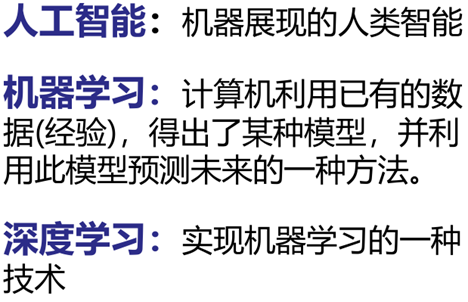

简单来说，就是**目标，手段，技术**

------

### 机器学习三步骤

•**定义一个model即function set**

•**定义一个goodness of function损失函数去评估该function的好坏**

•**找一个最好的function（训练）**

------

## 第一章 回归

### **解释过拟合和欠拟合现象和原因**

- 过拟合：在训练数据上表现好，但测试数据上表现差。过拟合本质原因：为了更好地拟合训练数据，模型引入了过多高次项。曲线过于曲折，往往导致过拟合，对 test 的误差更大。**Bias较小，Variance较大**

- 欠拟合：欠拟合指即使是在训练集上效果也不好，训练样本的一般性质也没有学习到位，在测试集上的效果也很差，原因是迭代次数太少或模型过于简单，**Bias较大，Variance较小**

------

### **解释方差（Variance）和偏差（bias）的概念**

•variance：方差是指**训练的结果与训练结果平均值之间的方差**。即**<u>训练结果是不是集中</u>**

方差度量了同样大小的训练集的变动所导致的学习性能的变化，即刻画了数据扰动所造成的影响。方差越大，说明数据分布越分散。 

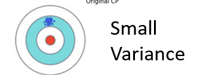

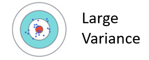

•bias：偏差是指**训练结果平均值与真实值之间的偏差。**即**<u>训练结果有没有偏离正确结果。</u>**

偏差度量了模型的期望预测与真实结果的偏离程度，即刻画了学习算法本身的拟合能力。偏差则表现为在特定分布上的适应能力，偏差越大越偏离真实值。

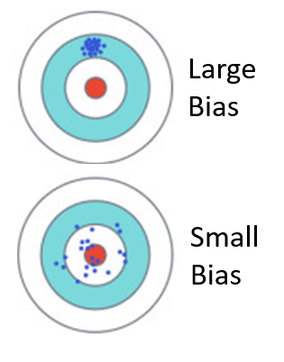

------

### **正则化的概念和目的**

引入参数权重到损失函数中，在最小化 loss 的同时尽量减小权重的值。更小的权重意味着模型曲线更平滑，使得高次项对曲线形状的影响尽可能小，**可以有效解决过拟合问题**。正则化项控制权重的更新，控制模型复杂度。

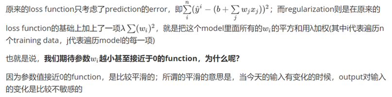

------

### **简述几种降低过拟合和欠拟合风险的方法**

- 欠拟合bias太大：添加新的特征；线性函数引入高次项；减小或取消正则化。
- 过拟合variance太大：使用更多数据；使用正则化；减小数据复杂度。

------

### 什么是交叉验证，有什么用？

 $( 1) $ train set 分为 train 和 validation。训练train。

 (2) 找在 validation 中表现最好的模型(loss 最小)。

(3) 不变参数，在整个 train set 上重新训练，即为最终模型。

交叉验证的主要目的是**检验当前模型对新数据的预测能力**，同时也能够**避免过拟合**，还可以选择合适的超参数和模型。

------

## 第二章 梯度下降

### **简述梯度下降的过程**

梯度：梯度即LOSS函数在某一点最大的偏导数，函数沿梯度方向时LOSS函数有最大的变化率，梯度下降即为从某一点出发，计算该点的梯度，以一定的学习率朝着梯度的反方向出发（因为这样LOSS函数的值下降最快），到达下一个点，重复上述步骤直到达到最大迭代次数或者梯度足够接近于0，即为梯度下降的过程。

$W^(t+1)=w^t-ηdL/dw$

------

### Adagrad方法解决了什么问题，如何做的？

解决的问题：在传统梯度下降中，学习率通常是固定的，但在梯度不一样的地方，我们应该使用不一样的学习率，例如平缓的地方，应该减小学习率，陡峭的地方应该增大学习率。

Adagrad 的核心思想是根据**参数的梯度历史信息**来调整学习率。具体来说，对于每个参数 w，在每个时间步 t，Adagrad 会根据参数 w 在过去的梯度平方的累积和来调整学习率。

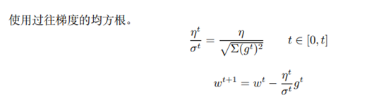

### 随机梯度(SGD)下降解决了什么问题，如何做的？

解决传统梯度下降算法在处理大规模数据集时的效率问题。<u>传统梯度下降算法在每次迭代时需要计算整个训练集的梯度</u>，这在大规模数据集上会导致计算量很大。SGD 通过每次迭代只使用部分数据来计算梯度，从而提高了训练的效率。

SGD 在每次迭代时**随机选择一个样本或者一小部分样本来计算梯度**，并使用这个梯度来更新整个模型的参数。虽然每次迭代的参数更新可能会受到单个样本的影响，但在训练过程中，经过足够多的迭代，参数通常会收敛到较好的解。

### 　随机梯度下降法失效的原因

摸着石头下山，，批量梯度下降法（Batch Gradient Descent，BGD）就好比正常下山， 而随机梯度下降法就好比蒙着眼睛下山。但由于每步接受的信息量有限，随机梯度下降法对梯度的估计常常出现偏差，造成目标函 数曲线收敛得很不稳定，伴有剧烈波动，有时甚至出现不收敛的情况。

------

### 什么是归一化和标准化，有什么用？

归一化（Normalization）和标准化（Standardization）是在数据处理和特征工程中常用的两种方法，用于将数据转换为特定的范围或分布，以便更好地适应模型的训练，加快收敛的速度。

1. 归一化（Normalization）：
   **归一化是将数据缩放到一个固定的范围，**通常是 [0, 1] 或者 [-1, 1]。这个过程可以通过以下公式实现：
   x' = (x - min(x)) / (max(x) - min(x))
   其中，x 是原始数据，x' 是归一化后的数据。这样的处理可以让不同特征的取值范围统一，避免因为数据范围不同而导致某些特征对模型的影响过大，同时可以加速模型的收敛速度。
2. 标准化（Standardization）：
   **标准化是使数据的均值为 0，方差为 1。**这个过程可以通过以下公式实现：
   x' = (x - μ) / σ
   其中，x 是原始数据，x' 是标准化后的数据，μ 是数据的均值，σ 是数据的标准差。标准化可以使数据更符合正态分布，减少特征间的方差差异，有助于模型更好地理解和利用数据。也有助于加速模型的收敛。

------

## 第三章 分类

### 简述机器学习任务中，回归和分类任务的区别

分类任务 和 回归任务 的区别在于需要预测的值的类型：

回归任务，是对**连续值**进行预测（比如 数量多少；）

分类任务，是对 **离散值** 进行预测，或者说是判断（比如 是不是，属不属于，或者 属于哪一类）。

------

### **分类和回归任务的模型输出区别**

 **分类问题输出的是定性的类别，回归问题输出的是定量的具体数值/标量**。

------

### 为什么分类任务不能用回归来解决？

- 决策边界偏移：Regression 的 output 是连续性质的数值，⽽ classification 要求的 output 是离散性质的点，我们很难找到⼀个 Regression 的 function 使⼤部分样本点的 output 都集中在某⼏个离散的点附近，这使得决策分界很难划定。反过来，如果使用回归得了"好"/"坏"的分界，那么离分界较远的点会显著影响这个分界的划分。
- 多元分类隐含关联性，使用连续结果刻画分类暗含着第一类与第二类相比于第一类和第三类更近的关联性。

------

### **简述判别模型（逻辑回归）和生成模型（概率生成）各自的做法以及两种方法的区别**

**判别模型**：逻辑回归不进行假设，使用一个逻辑函数（sigmoid函数）将输入特征映射到一个0到1之间的概率值，利⽤交叉熵和 gradient descent 结合极⼤似然估计法得到最优的 b 和 w ，用于表示样本属于某个类别的概率，进而判断分类。

**生成模型**：首先得到训练集，直接求出先验概率；然后假设训练集和潜在的待预测数据符合某一种特定的概率分布，根据训练集，利用最大似然估计的方法要求出两类别的均值 µ 和协方差矩阵 Σ，拟合这种分布，求出后验概率，然后通过贝叶斯公式求出分类。

**区别**：前者训练决策函数，使误差最小化的参数提取特征，使用梯度下降训练参数。后者则是假设分布并计算分布可能性最大时的分布参数，再根据朴素贝叶斯计算分类概率。

- 判别模型关注的是对给定输入的条件下预测输出的概率分布**，它直接对决策边界或分类函数进行建模，不涉及对数据的生成过程**。
- 生成模型关注的是对输入和输出的联合概率分布进行建模，**它不仅可以用于预测，还可以用于生成新的样本数据，因为它对数据的分布进行了建模**。

**优势对比：**生成模型有一个分布假设，判别模型无假设。所以生成模型一般没有判别模型表现好。但是生成模型假设分布能使用更少的数据训练并抗噪音更好一点。（因为已经假设了分布）

------

### 逻辑回归和线性回归的异同？

**区别：**

1. 解决的问题：
   - 逻辑回归：输出通过 sigmoid 函数产生，因此介于 0 到 1 之间，用于分类问题。
   - 线性回归：输出没有经过 sigmoid 函数处理，可以是任何实数值，用于连续数值预测。
2. 损失函数：
   - 逻辑回归：使用**交叉熵函数**作为损失函数，目标是最小化所有样本点在伯努利分布下的交叉熵总和，用于衡量预测概率与实际分类之间的差异。
   - 线性回归：使用平方误差等作为损失函数，目标是最小化预测值与实际值之间的平方差的均值。
3. 目标与输出范围：
   - 逻辑回归：目标是预测样本属于某一类别的概率，输出范围是 0 到 1。
   - 线性回归：目标是预测连续数值，输出范围可以是任意实数值。

**相同点：**

1. 参数更新：逻辑回归和线性回归中更新模型参数$w_i$的方式是相同的，即梯度下降，以最小化损失函数。
2. 线性关系：逻辑回归和线性回归都是基于输入特征的线性组合进行建模，尽管逻辑回归的输出经过了 sigmoid 函数的转换。

------

### **逻辑回归中，若使用平法误差作为损失函数的表示，可行吗？**

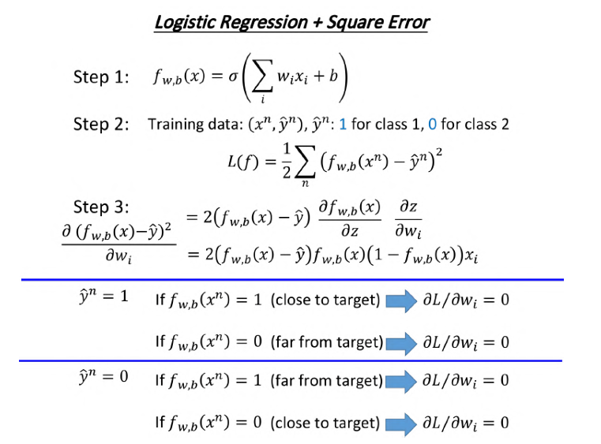

计算此时的梯度函数，可以看到其包含fx和（1-fx）两个因子，则当fx趋近于0或1时，梯度都会接近0，使得训练变得非常缓慢，因为距离⽬标远的时候，微分也是⾮常⼩的，移动的速度也是⾮常慢。

------

### 逻辑回归的限制？

Logistic Regression 在两个 class 之间的 boundary 就是⼀条直线，但是在这个平⾯上⽆论怎么画直 线都不可能把图中的两个 class 分隔开来

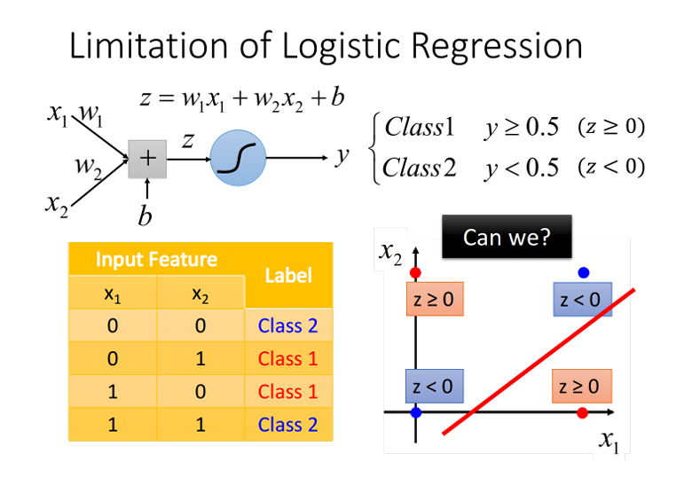

可以通过特征转化使它们有一条线性分界线来解决。

------

## 第四章 深度学习

### 简述深度学习训练时，反向传播都做了什么

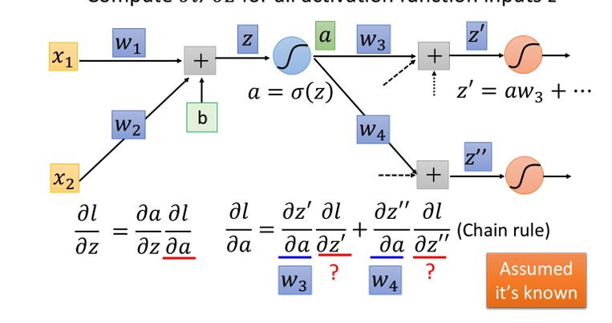

在神经网络的训练中，计算梯度的开销非常大，这个时候需要使用反向传播来提高效率。

反向传播主要应用了链式法则的性质，我们先给出梯度公式，
$$
\frac{\partial L(\theta)}{\partial w}=\sum_{n=1}^N\frac{\partial l^n(\theta)}{\partial w}
$$
现在的问题是这样$:\frac{\partial l}{\partial w}$该怎么算？按照chain rule, 可以把它拆分成两项，
$$
\frac{\partial l}{\partial w}=\frac{\partial z}{\partial w}\frac{\partial l}{\partial z}
$$
这两项分别去把它计算出来。计算前面这一项$\frac{\partial z}{\partial w}$的这个process，我们称之为Forward pass; 而计算后面这项$\frac{\partial l}{\partial z}$的process，我们称之为Backward pass

显然，正向传播部分$\frac{\partial z}{\partial w}=x$既是神经元的输入，对于$\frac{\partial l}{\partial z}$，有链式法则如下：
$$
\frac{\partial l}{\partial z}=\frac{\partial a}{\partial z}\frac{\partial l}{\partial a}
$$
前部分显然就是$sigmod$函数的导数，后半部分$\frac{\partial l}{\partial a}$进入循环操作，因为a是激活函数的输出，也是下一个神经元的输入，有：
$$
\frac{\partial l}{\partial a}=\frac{\partial z^\prime}{\partial a}\frac{\partial l}{\partial z^\prime}+\frac{\partial z^{\prime\prime}}{\partial a}\frac{\partial l}{\partial z^{\prime\prime}}
$$
其中z/a=w，而l/z形成了递归。

**最终的反向传播递归公式：**

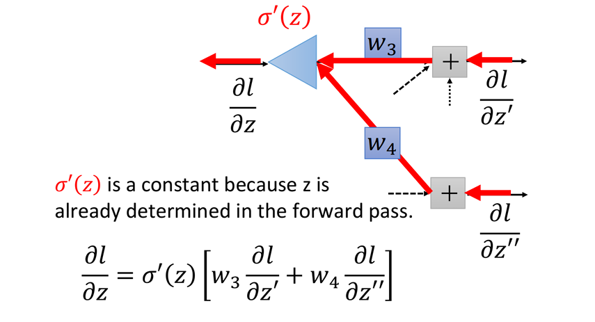

最后，我们来总结一下反向传播是怎么做的【考试不要写这个，写上面那个】：

Forward pass, 每个neuron的activation function的output，就是它所连接的weight的$\frac{\partial z}{\partial w}$
Backward pass, 建一个与原来方向相反的neural network, 它的三角形neuron的output就是$\frac{\partial l}{\partial z}$

把通过forward pass得到的$\frac{\partial z}{\partial w}$和通过backward pass得到的$\frac{\partial l}{\partial z}$乘起来就可以得到$l$对$w$的偏微分$\frac{\partial l}{\partial w}$
$$
\begin{aligned}\frac{\partial l}{\partial w}=\frac{\partial z}{\partial w}|_{forward\:pass}\cdot\frac{\partial l}{\partial z}|_{backward\:pass}\end{aligned}
$$

------

### 什么是深度学习中的模块化

DNN结构⼀个很⼤的优势是，Modularization(模块化)，它⽤的是结构化的架构，上每⼀层layer⾥的neuron都像是在解决同⼀个级别的任务，它们的output作为 下⼀层layer处理更⾼级别任务的数据来源。

这样做的好处是，低层的neuron输出的信息可以被⾼层不同的neuron重复使⽤，⽽并不需要像浅层network⼀样，每次在⽤到的时候都要重新去检测⼀遍，因此⼤⼤降低了程序的复杂度。每个基本分类器都可以有足够的训练示例，并且可以使用更少的数据得到好的结果。三是网络自己提取特征，较人为指定的特征个接近最优解（特征提取效率高）。

------

### 　神经网络训练时是否可以将全部参数初始化为0？

考虑全连接的深度神经网络，同一层中的任意神经元都是同构的，它们拥有 相同的输入和输出，如果再将参数全部初始化为同样的值，那么无论前向传播还 是反向传播的取值都是完全相同的。学习过程将永远无法打破这种对称性，最终 同一网络层中的各个参数仍然是相同的。需要随机地初始化神经网络参数的值，以打破这种对称性。

##  第五章 卷积神经网络CNN

### 图片识别为什么要使用CNN

- 对图像特征的局部性和平移不变性，使得CNN能够更好地处理图像数据，提取局部特征
- 参数共享和稀疏连接：CNN中的卷积操作允许参数共享，这使得网络具有更少的参数，同时增加泛化能力。
- 分层特征提取：CNN通常由多层卷积层和池化层组成，可以实现分层的特征提取，从低级特征到高级语义特征的逐步提取，这有利于捕获图像中的复杂结构和模式。
- 使用池化层，对图像二次采样不会改变对象，实现了数据降维，大大减小需要计算的数据量。

------

### 简述CNN的卷积层和池化层，各自的实现了什么特性，以及做了什么

卷积层：

- 特性：卷积层主要用于特征提取（稀疏操作，权值共享）。它通过卷积操作将输入数据与一组可学习的滤波器进行卷积运算，生成一系列的特征图（Feature Map）
- 实现：卷积操作将滤波器与输入数据的局部区域逐元素相乘，并对结果求和，得到卷积输出的一个元素。通过滑动窗口的方式，逐步遍历整个输入数据，从而生成特征图。卷积层通过共享权重和局部连接(稀疏操作)的方式，减少了需要训练的参数数量，提高了模型的效率。

池化层：

- 特性：池化层主要用于**降低特征图的空间维度**，减少计算量和参数数量，并提取出特征的位置不变性。它通过对特征图的局部区域进行池化操作，将区域内的特征值进行聚合，得到更小尺寸的特征图。除此之外，**保持对平移、伸缩、旋转操作的不变性。**
- 实现：常见的池化操作有最大池化（Max Pooling）和平均池化（Average Pooling）。最大池化选择区域内的最大值作为池化操作的结果，用来提取最显著的特征。平均池化计算区域内特征值的平均值，用于保留整体特征信息。池化层通过减少特征图的空间维度，可以降低特征图的尺寸和数量，减少模型参数和计算量，同时提高模型的泛化能力。

------

### CNN中，卷积操作的本质特性包括稀疏交互和参数共享，具体解释这两种特性及其作用

稀疏交互（Sparse Interaction）：

- 卷积操作通过使用滤波器（卷积核）与输入数据进行逐元素相乘，并对结果求和来实现特征的提取。在这个过程中，滤波器与输入数据之间是局部连接的，即每个滤波器只与输入数据的一小部分区域相互作用。这种局部连接使得卷积操作具有稀疏交互的特性。

- 稀疏交互的作用在于：

  （1）**减少计算量**：由于滤波器与输入数据的部分区域相互作用，可以大大减少计算操作的数量，提高运算效率。

  （2）**提取局部特征**：卷积操作通过局部连接的方式，能够更有效地提取输入数据的局部特征，从而捕捉到图像、文本等数据中的局部模式。

参数共享（Parameter Sharing）：

- 在卷积操作中，如果对于同一卷积核在不同位置的应用使用不同的权重参数，那么需要学习的参数数量将非常庞大，从而导致过拟合和计算复杂度过高的问题。因此，CNN采用了权值共享的方法，即对于卷积核在不同位置的应用，使用相同的权重参数。

- 作用：

  （1）**减少模型复杂度和计算成本**：通过共享参数，可以大大减少模型中需要学习的参数数量，降低了模型的复杂度和存储需求，

  （2）增强特征的泛化能力：共享参数可以使得卷积操作对输入数据的不同位置具有相同的响应，从而增强了特征的泛化能力和**对平移不变性的学习**。

【在CNN中，通常会使用多个不同的卷积核来构建一个过滤器。每个卷积核可以提取不同的特征，例如边缘、纹理等。通过使用多个卷积核，过滤器可以同时提取多种不同的特征。】

------

### 　卷积神经网络如何用于文本分类任务？

卷积神经网络的核心思想是捕捉局部特征，对于文本来说，**局部特征就是由若干单词组成的滑动窗口。**卷积神经网络的优势在于能够自动地对特征进行组合和筛选，获得不同抽象层次的语义信息。由于在每次卷积中采 用了共享权重的机制，因此它的训练速度相对较快，在实际的文本分类任务中取 得了非常不错的效果。

## 第六章 神经网络训练技巧

### 梯度消失产生的原因以及如何解决

**原因：**

某一个参数$w$对total cost $l$的偏微分，即gradient $\frac{\partial l}{\partial w}$,其数学意义时w变化时其对loss的影响；把第一个layer里的某一个参数$w$加上$\Delta w$, 看看对network的output和target之间的loss有什么样的影响。

$\Delta w$通过sigmoid function（值域在0-1之间）之后，得到output是会变小的，改变某一个参数的weight，会对某个neuron的output值产生影响，但是这个影响是会随着层数的递增而衰减的，sigmoid function的形状如下所示，它会把负无穷大到正无穷大之间的值都硬压到0~1之间，把较大的input压缩成较小的output。

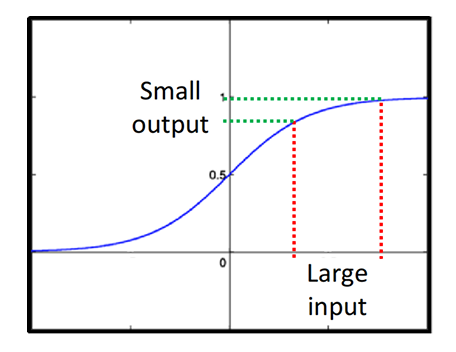

因此即使$\Delta w$值很大，但每经过一个sigmoid function就会被缩小一次，所以network越深，$\Delta w$被衰减的次数就越多，直到最后，它对output的影响就是比较小的，相应的也导致input对loss的影响会比较小，于是靠近input的那些weight对loss的gradient $\frac{\partial l}{\partial w}$远小于靠近output的gradient。

**解决办法：**

使用适当的激活函数，如**ReLU**，一个分段函数，小于 0 取 0，大于 0 取 x（正比例） ，在正数区间上，ReLU函数的导数(微分)恒为1，避免了梯度消失的问题。**Maxout** 的原理是同层神经元几个一组，取其中最大的 z 作为 a。也是分段函数，非线性。其中分段函数的形式，完全由同组内的 w，b 决定。 (z = Σwx + b)。Maxout激活函数允许神经网络学习激活函数本身。

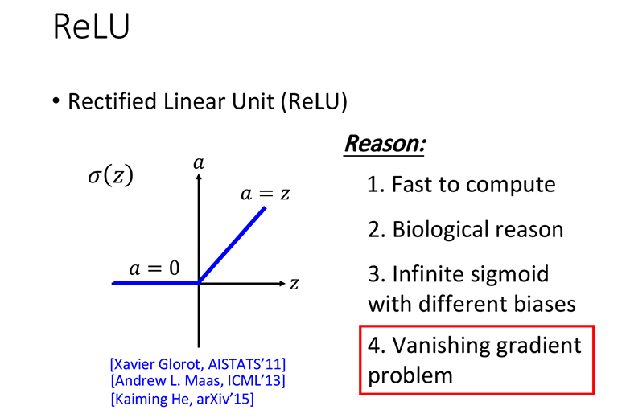

### 什么是ReLU，有什么优点？

是一个激活函数，该函数的形状是一个分段函数，小于0取0，大于0取wx，

优点：

- 跟sigmoid function比起来，ReLU的运算快很多，因为当小于零时，取0相当于这个神经元被剪掉了，使神经网络动态地变瘦。
- ReLU的想法符合真实生物学，模仿生物神经元，正反馈。
- 无穷多bias不同的sigmoid function叠加的结果会变成ReLU，突显了ReLU函数在拟合非线性关系方面的优势。
-  ReLU可以处理梯度消失的问题，因为在正数区间上，ReLU函数的导数(微分)恒为1，避免了梯度消失的情况，从而有助于神经网络的训练。

### 什么是RMSProp 自适应学习率方法以及解决了什么问题？

学习率应该在陡峭的地方小，在平缓的地方大，所以引入自适应学习率的方法。
$$
W^{t+1}=w^{t}-\frac{\eta}{\sigma^{t}}g^{t}
$$

$$
\sigma^{t}=\sqrt{\alpha(\sigma^{t-1})^{2}+(1-\alpha)(g^{t})^{2}}
$$

相较于 adagrad 的本质就是调节当前梯度的比重(它⽤⼀个α来调整对不同 gradient 的使⽤程度)。

### 冲量(momentum)方法做了什么以及解决了什么问题

一般的梯度下降算法权重的变化方向就是梯度下降的方向。但冲量方法移动方向为前一步更新时的运动方向减去梯度方向。因此，即使梯度为 0，也能照着之前的方向继续走，从而脱离鞍点或局部最小值。
$$
v^1=\lambda v^0-\eta\nabla L(\theta^0)
$$

注：这里的$\lambda$也是一个手动调整的参数，它表示惯性对前进方向的影响有多大

### 如何脱离鞍点？

1.冲量

2.计算矩阵特征值，如果是正定矩阵就最优，如果有特征值大于零有特征值小于零就是鞍点，往u那个方向走。

### 怎么脱离局部最优？

1.冲量

2.使用小批量（mini-batch）训练和随机梯度下降（SGD）可以缓解

### 什么是Adam

RMSProp 加上 Momentum ，就可以得到 Adam

### dropout方法做了什么以及解决了什么问题

减少神经网络out方法的实现方式是在训练过程中以一定的概率p随机地将某些神经元置零。在测试过程中，所有的神经元都参与计算，但是各自的权重需要乘以1-p。

解决问题：减少神经网络的复杂度过高；**避免过拟合现象（关键）**；一定程度上减少训练较差的神经元对已经训练好的神经元的影响；每个神经元干的任务更重，训练更彻底。

### L1&L2 正则化

**L2**
$$
\begin{aligned}L'(\theta)=L(\theta)+\lambda\frac{1}{2}|\theta|_{2} \\|\theta|_2&=|w^1|^2+...\end{aligned}
$$

求导

$$
\frac{\vartheta L^{\prime}}{\vartheta w}=\frac{\vartheta L}{\vartheta w}+\lambda w
$$

更新的函数化简一下可以看到 L2 正则化**使用乘法进行权重衰减**。

**L1**
$$
w^{t+1}=(1-\eta\lambda)w^{t}-\eta\frac{\vartheta L}{\vartheta w}
$$

$$
\begin{aligned}L'(\theta)&=L(\theta)+\lambda\frac{1}{2}|\theta|_1\\|\theta|_1&=|w^1|+...\end{aligned}
$$

求导 (上面是绝对值，sgn(x) 表示返回 x 的符号)

$$
\frac{\vartheta L^{\prime}}{\vartheta w}=\frac{\vartheta L}{\vartheta w}+\lambda sgn(w)
$$

更新的函数化简一下可以看到 L2 正则化**使用加法进行权重衰减**。(绝对值整体是让 w 往 0 靠，可小于大于 0)

$$
w^{t+1}=w^t-\eta\frac{\vartheta L}{\vartheta w}-\eta\lambda sgn(w^t)
$$
L1 使参数绝对值变⼩的⽅式是每次 update 减掉⼀个固定的值，L2 使参数绝对值变⼩的⽅式是每次 update 乘上⼀个⼩于 1 的固定值。因此，当参数 w 的绝对值⽐较⼤的时候， L2 会让 w 下降得更快，⽽ L1 每次 update 只让 w 减去⼀个固定的 值， train 完以后可能还会有很多⽐较⼤的参数；当参数 w 的绝对值⽐较⼩的时候， L2 的下降速度就会变 得很慢， train 出来的参数平均都是⽐较⼩的，⽽ L1 每次下降⼀个固定的 value ， train 出来的参数是⽐较 sparse 的，这些参数有很多是接近 0 的值，也会有很⼤的值。

### 　L1正则化使得模型参数具有稀疏性的原理是什么？

**从解空间来看**：以二维为例，L2正则项约束后的解空间是圆形，而L1正则项约束的解空间是多边形。 显然，多边形的解空间更容易在尖角处与等高线碰撞出稀疏解。即如果原问题目标函数的最优解不是恰好落在解空间内，那么 约束条件下的最优解一定是在解空间的边界上，而L1“棱角分明”的解空间显然更容易与目标函数等高线在角点碰撞，从而产生稀疏解。

**从函数叠加来看：**加入L1正则项后，对带正则项的目标函数求 导，正则项部分产生的导数在原点左边部分是−C，在原点右边部分是C，因此， 只要原目标函数的导数绝对值小于C，那么带正则项的目标函数在原点左边部分始终是递减的，在原点右边部分始终是递增的，最小值点自然在原点处。相反，L2 正则项在原点处的导数是0，只要原目标函数在原点处的导数不为0，那么最小值点就不会在原点，所以L2只有减小w绝对值的作用，对解空间的稀疏性没有贡献。

### batch如何带来优化？

在训练神经网络等机器学习模型时，通常会将训练数据集分成若干个批次（batch），每个批次包含多个训练样本，每次迭代只使用一个batch更新梯度，而不是全部数据。

具有以下好处：

1. **加速训练过程**：将训练数据集分成批次可以利用并行计算的优势，加速模型的训练过程。

2. **减少内存需求**：通过批处理，可以将大规模的训练数据分成小块，降低了对内存的需求，使得训练可以在内存有限的设备上进行。

3. **更好的泛化能力**：使用批处理可以避免模型过度拟合单个样本，有助于提高模型的泛化能力。

   ------

### 大batch和小batch的区别？

小batch训练的模型泛化能力更强，更快地收敛到最优解，需要的内存更少。

大batch一次epoch的时间更短，需要更多的内存，因为一次性处理更多的数据。

------

### 有监督学习涉及的损失函数有哪些？请列举并简述它们的特点。

1. **平方误差（Mean Squared Error，MSE）**：MSE是回归问题中最常见的损失函数，它计算预测值与真实值之间的平方差的平均值。特点是对异常值敏感，即异常值的存在会对损失产生较大影响。
2. **平均绝对误差（Mean Absolute Error，MAE）**：MAE也用于回归问题，它计算预测值与真实值之间的绝对差值的平均值。相对于MSE，MAE对异常值更具鲁棒性。
3. **对数损失（Logarithmic Loss，Log Loss）**：对数损失常用于二分类或多分类问题中，它衡量了分类问题中预测概率分布与真实标签之间的差异。对数损失的特点是对概率分布的误差敏感，越接近真实标签的预测概率，损失越小。
4. **交叉熵损失（Cross Entropy Loss）**：交叉熵损失也用于分类问题，它衡量了两个概率分布之间的相似度，通常用于多分类问题。交叉熵损失的特点是能够更好地反映分类问题中的分类准确性，对预测概率的不确定性更为敏感。
5. **0-1误差**：对二分类问题，。该损失函数能够直观地刻画分类的错误率，但是由于其非凸、非光滑的特点， 使得算法很难直接对该函数进行优化。

## 第七章 $RNN$（循环神经网络）

### 相比$CNN$与传统$DNN$，$RNN$是为了解决什么问题？如何解决的？

对于语言文本处理的任务，如机器翻译、情感分析、语言模型等，**上下文的联系**对于理解和处理文本是非常重要的。而传统的DNN和CNN是无法直接处理这种上下文联系的，同时，也会丢失**文本的顺序**。

为了解决这个问题，循环神经网络（RNN）被引入。RNN引入了记忆机制，通过在每个时间步骤上引入一个memory，将当前的输入和前一时刻的memory结合起来进行计算，并将新的结果写入memory 。这种记忆机制使得信息可以在时间维度上传递，从而捕捉到序列中的时间依赖关系。

------

### 长短时记忆网络$LSTM$四个主要的模块及其各自作用

1.**输入门**（Input Gate）：输入门控制着新的输入信息对于记忆状态的更新。若$f(z_i)=0$,则相当于没有输入，若$f(z_i)=1$,则相当于输入$g(z)$.

2.**遗忘门**（Forget Gate）：遗忘门控制着旧的记忆状态对于更新的影响。它通过对当前输入和前一时刻隐藏状态进行加权和激活操作，输出一个介于0和1之间的数值，表示应该如何保留或遗忘旧的记忆状态。遗忘门的作用是决定哪些旧的记忆应该被记忆。若$f(z_f)=1$,则保存原来的值$c$并加到新的值上，若$f(z_f)=0$,则旧的值将被遗忘清除。

3.**记忆单元**（Memory Cell）：记忆单元负责存储并传递记忆信息。在每个时间步骤，记忆单元会根据输入门和遗忘门的输出来更新记忆状态。记忆单元的作用是存储长期的记忆信息，以便在后续的时间步骤中使用。

4.**输出门**（Output Gate）：输出门控制着记忆状态对于当前时刻的隐藏状态的影响。它通过对当前输入和前一时刻隐藏状态进行加权和激活操作，输出一个介于0和1之间的数值，表示应该如何生成当前时刻的隐藏状态。输出门的作用是决定记忆状态中哪些信息应该被输出。

经过记忆单元后`c′ =f(zi)g(data)+f(zf)c`，分别是输入门，遗忘门控制信号。输出为`a=f(zo)h(c)`， 为输出门控制信号。

------

### 　LSTM是如何实现长短期记忆功能的？

在一个训练好的网络中，当输入的序列中没有重要信息时，LSTM的遗忘门的值接近于1，输入门的值接近于0，此时过去的记忆会被保存，从而实现了长期记忆功能；当输入的序列中出现了重要的信息时，LSTM应当把其存入记忆中，此时其输入门的值会接近于1；当输入的序列中出现了重要信息，且该信息意味着之前的记忆不再重要时，输入门的值接近1，而遗忘门的值接近于0，这样旧的记忆被遗忘，新的重要信息被记忆。经过这样的设计，整个网络更容易学习到序列之间的长期依赖。

### LSTM里各模块分别使用什么激活函数，可以使用别的激活函数吗？

在LSTM中，遗忘门、输入门和输出门使用Sigmoid函数作为激活函数；在记忆单元状态，使用双曲正切函数Tanh作为激活函数。

激活函数的选择也不是一成不变的。只不过 Sigmoid函数的输出在0～1之间，符合门控的物理定义。 且当输入较大或较小时，其输出会非常接近1或0，从而保证该门开或关。在生成 候选记忆时，使用Tanh函数，是因为其输出在−1～1之间，这与大多数场景下特征分布是0中心的吻合。此外，Tanh函数在输入为0附近相比Sigmoid函数有更大的梯度，通常使模型收敛更快。

### $RNN$训练中为什么会出现梯度爆炸/消失现象，该如何缓解？

#### 梯度爆炸/消失的原因

造成梯度爆炸或消失的主要原因是RNN中的时间步骤（time steps）导致了梯度的连乘效应。在反向传播过程中，梯度会通过时间步骤的乘法操作进行传递，如果每个时间步骤上的梯度都大于1，那么经过多个时间步骤后，梯度就会呈指数级增长，导致梯度爆炸的问题。梯度消失同理。

#### 如何缓解

**梯度爆炸**可以用clipping 解决，即限制梯度的最大下降限度。

`LSTM `可解决**梯度消失**，`LSTM`复杂的门结构，更新时会记住前面几次的残留记忆。前面的影响不会消失，除非遗忘门关闭。因此，如果遗忘门打开，就无梯度消失问题。但不能解决梯度爆炸

------

### RNN 和 LSTM 对 memory 的处理不同点

在 `RNN` 中，每个新的时间点， memory ⾥的旧值都会被新值所覆盖 ,在` LSTM `中，每个新的时间点， memory ⾥的值会乘上$f(g_f)$.对 `RNN` 来说， 与新值相加对 memory 的影响每次都会被清除，⽽对` LSTM `来说，除⾮ forget gate 被打开，否则w对 memory 的影响就不会被清除，⽽是⼀直累加保留，因此它不会有梯度消失的问题.

------

### 　在循环神经网络中能否使用ReLU作为激活函数？（扩展）

可以，但是需要初始化W为单位矩阵。

如果采用ReLU替代公式中的激活函数$f$, 并且假设ReLU函数一直处于激活区域(即输入大于0), 则有$f(x)=x,net_t=Ux_t+W(Ux_{t-1}+Wh_{t-2})$。继续将其展开，$net_t$ 的表达式中最终包含t个W连乘。如果W不是单位矩阵(对角线上的元素为1，其余元素为0的矩阵),最终的结果将会趋于0或者无穷，引发严重的数值问题。那么为什么在卷积神经网络中不会出现这样的现象呢？这是因为在卷积神经网络中每一层的权重矩阵$w$是不同的，并且在初始化时它们是独立同分布的，因此可以相互抵消，在多层之后一般不会出现严重的数值问题。

当采用ReLU作为循环神经网络中隐含层的激活函数时，只有当W 的取值在单位矩阵附近时才能取得比较好的效果，因此**需要将W初始化为单位矩阵**。实验证明，初始化W为单位矩阵并使用ReLU激活函数在一些应用中取得了与 LSTM相似的结果，并且学习速度比长短期记忆模型更快，是一个值得 尝试的小技巧.

## 第八章 半监督学习

### 半监督学习中的生成模型方法和监督学习中的有何异同？

相同点：

整体的思路是相同的，都是通过假设符合某种分布，然后计算先验概率，通过极大似然估计计算出分布，然后根据分布计算后验概率，最后通过贝叶斯分类器完成分类。

不同点：

在**监督学习中的概率生成模型**下，有一组已经标记好的数据，其中输入和输出之间存在明确的对应关系。模型通过学习这些标记好的数据来预测未知数据的输出。通过假设class1和class2的分布分别为$mean_1=u^1,covariance_1=\Sigma$、$mean_2=u^2,covariance_2=\Sigma$的高斯分布，计算出先验概率，再根据贝叶斯公式可以推得新生成的x所属的类别。

在**半监督学习**中，有一组标记好的数据和一组未标记的数据。这时首先使用 label 数据进行估计，得出高斯分布假设下的相关参数。之后使用未 label 的数据对模型重新估计，更新参数模型。即把unlabeled data $x^{u}$看成是可以划分的，一部分属于$C_1$, 一部分属于$C_2$，此时它的概率$P_\theta(x^u$)
 =$P_\theta(x^u|C_1)P(C_1)+P_\theta(x^u|C_2)P(C_2)$, 也就是$C_1$的先验概率乘上$C_1$这个class产生$x^u$的概率+$C_{2}$的先验概率乘上$C_{2}$这个class产生$x^u$的概率。

【以下是公式，考试不用答，只是便于理解：】

> (1) 初始化参数 $P(C_1),P(C_2),\mu_1,\mu_2,\Sigma$。采用 label 数据
>
> (2) 根据模型计算未 label 的 $P(C_1|X^u)$。
>
> (3) 根据以下公式更新参数。即 $\Sigma P(C_1|X^u)$ 约等于未 label 的 $C_{1}$ 数目。
> $$
> P(C_1)=\frac{N1+\Sigma P(C_1|X^u)}N
> $$
>
> $$
> \mu_{1}=\frac{1}{N1}\Sigma x^{r}+\frac{1}{\Sigma P(C_{1}|X^{u})}\Sigma P(C_{1}|X^{u})x^{u}
> $$
>
> (4)循环执行 2, 3 步，直至参数收敛。

------

### Hard label / Soft label 区别(低密度分离假设)

#### 什么是低密度分离假设和自我训练

这个世界是⾮⿊即⽩的，在两个 class 的交界处 data 的密度 (density) 是很低的，它们之间会有⼀道明显的鸿沟。`low-density separation` 最具代表性也最简单的⽅法是 `self training`

self-training: 

(1) 根据 label 数据训练模型，什么方法都可以。除了回归。

(2) 根据模型**对未 label 的数据计算伪标签** (pseudo-lable)。

(3) 选取一部分伪标签数据加入到标签数据。重复 1, 2, 3 直至模型收敛。这部分可以自己定怎么选，也可以自己定怎么加权重。

**为什么回归不能用自我训练**，因为回归预测出来的数据重新用来做训练，不会影响模型的参数。(模型的参数本来就是这个)。

#### Hard label / Soft label 区别

`Self Training`使用的是hard label: 假设一笔data强制属于某个class ，即对未 label 数据指定一个分类，体现出了非黑即白的思想。

`Generative Model`【生成模型】使用的是soft label: 假设一笔data可以按照概率划分，不同部分属于不同class，计算标签带着概率。xx 为 0.7，xx 为 0.3（类似生成模型），

如果我们使用的是neural network的做法，$\theta^*$是从labeled data中得到的一组参数，此时进来一个unlabeled data $x^u$, 通过$f_{\theta^*}^*()$后得到$\begin{bmatrix}0.7\\0.3\end{bmatrix}$, 即它有0.7的概率属于class 1, 0.3的概率属于class 2 · 如果此时使用hard label, 则$x^u$的label被转化成$\begin{bmatrix}1\\0\end{bmatrix}$。如果此时使用soft label, 则$x^u$的label依旧是$\begin{bmatrix}0.7\\0.3\end{bmatrix}$ ，可以看到，在neural network里使用soft label是没有用的，因为把原始的model里的某个点丢回去重新训练，得到的依旧是同一组参数，`low density separation`通过强制分类来提升分类效果.

### 基于熵的正则化

基于熵的正则化是指在机器学习中使用熵（entropy）作为正则化项的一种方法。在训练模型时，除了最小化损失函数以匹配训练数据外，还可以通过添加正则化项来限制模型的复杂度，防止过拟合。基于熵的正则化利用信息熵的概念来实现这一目的。

在基于熵的正则化中，通常会将信息熵应用于模型的参数。信息熵是对不确定性的度量，可以用来衡量模型参数的分布。通过最小化模型参数的信息熵，可以**使得参数更加集中或者更加稀疏**，从而限制模型的复杂度。

具体来说，基于熵的正则化通常会将信息熵加入到损失函数中，形式上可以表示为：

$[ \text{损失函数} + \lambda \times \text{信息熵} ]$

其中，$(\lambda)$ 是控制正则化强度的超参数。通过调节 $(\lambda) $的值，可以平衡模型对训练数据的拟合程度和对参数分布的约束程度。基于熵的正则化可以有助于防止模型在训练数据上过度拟合，并且有时还可以促进模型参数的稀疏性，从而提高模型的泛化能力。

### 什么是平滑性假设？

就是所谓近朱者赤近墨者黑。

粗糙的定义是相似的x具有相同的$\hat{y}$, 精确的定义是：
x的分布是不平均的，如果$x^{1}$和$x^{2}$在一个high density region上很接近的话，那么$\hat{y}^{1}$和$\hat{y}^{2}$就是相同的

也就是这两个点可以在样本点高密度集中分布的区域块中有一条可连接的路径，即 connected by a high density path。

### 在半监督中，什么是基于图的方法？

graph-based approach的基本精神是，将数据点表示为图形,在graph上已经有⼀些labeled data，那么跟它们相连的 point，属于同⼀类的概率就会上升，每⼀笔data都会去影响它的邻居，⽽graph带来的最重要的好处 是，这个影响是会随着edges传递出去的，即使有些点并没有真的跟labeled data相连，也可以被传递 到相应的属性。这就是K近邻（KNN）。期望smooth的值越⼩越好。

------

## 第九章 无监督学习

> 【无监督学习目前所做的操作就是为了降维提取（PCA,聚类）之后可再升维，可以用来评估相似性，没 有y值的意义，既不是分类也不是回归，just 提取一个 x 或评估两个x】

### 无监督学习中的化繁为简/无中生有

对于无监督学习(Unsupervised Learning)来说，我们通常只会拥有$(x,\hat{y})$中的$x$或$\hat{y}$,其中：

- 化繁为简就是把复杂的input变成比较简单的output，比如把一大堆没有打上label的树图片转变为一棵抽象的树，此时training data只有input $x$,而没有output $\hat{y}$

- 无中生有就是随机给function一个数字，它就会生成不同的图像，此时training data没有input $x$ , 而只有output $\hat{y}$

  ------

  

### 简述聚类中的k-means方法

K-means是一种常用的聚类算法，用于将数据集划分为K个不同的簇，其步骤为：

1. 初始化：随机选择K个数据点作为初始的聚类中心。
2. 分配：对于每个数据点，计算其与每个聚类中心的距离，并将其分配给距离最近的聚类中心所属的簇。
3. 更新：对于每个簇，**计算簇中所有数据点的均值，将该均值作为新的聚类中心**。
4. 重复步骤2和3，直到聚类中心不再发生变化或达到预定的迭代次数。

K-means的目标是最小化簇内数据点与其对应聚类中心之间的平方距离之和，即最小化误差平方和。这意味着在每次迭代中，K-means算法会努力将簇内的数据点尽可能靠近其所属聚类中心。

------

### K均值算法的优缺点是什么？如何对其进行调优？

缺点：受初值和离群点的影响每次的结果不稳定、结果通常不是全局最优而是局部最优解、无法很好地解决数据簇分布差别比较大的情况（比如一类是另一类样本数量的100倍）、不太适用于离散分类，需要事先确定聚类数

优点：

1. 简单而高效：K均值算法易于理解和实现，计算复杂度较低，适用于大规模数据集。
2. 聚类效果较好：在处理紧密簇集的数据集时，K均值算法通常表现良

调优：

（1）数据归一化和离群点处理。

（2）合理选择K值

（3）采用核函数。核聚类方法的主要思想是通过**一个非线性映射，将输入空间中的数据点映射到 高位的特征空间中**，并在新的特征空间中进行聚类。非线性映射增加了数据点线 性可分的概率，从而在经典的聚类算法失效的情况下，通过引入核函数可以达到 更为准确的聚类结果。

### 简述聚类中的层次聚类

分层凝聚聚类（Hierarchical Agglomerative Clustering，简称HAC）是一种基于距离的层次聚类算法，它将数据点逐步合并形成层次化的聚类结构。

HAC的工作过程如下：

1. 初始化：将每个数据点视为一个单独的簇。
2. 计算距离矩阵：计算每对数据点之间的距离，可以使用不同的距离度量方法，如欧氏距离、曼哈顿距离等。
3. 合并最近的簇：从距离矩阵中找到距离最近的两个簇，并将它们合并成一个新的簇。
4. 更新距离矩阵：根据合并后的簇，更新距离矩阵，计算新的簇与其他簇之间的距离。
5. 重复步骤3和4，直到只剩下一个簇或达到预定的聚类数。

HAC生成的聚类结构可以形成类树，从不同深度划分可以得到不同大小和数量的分类。

------

### 简述PCA方法以及其实现的最主要目标

**PCA的主要目标**是降低数据的维度，同时保留尽可能多的信息。通过降维，PCA可以减少数据中的冗余信息和影响较小的特征，提取出最重要的特征，降维后的数据可以更好地可视化、处理和分析。

PCA的过程可以概括为以下几个步骤：

1. 计算数据矩阵的协方差矩阵。
2. 对协方差矩阵进行特征值分解，得到特征值和特征向量。
3. 选择特征值最大（即方差最大）的k个特征向量作为主成分方向。投影矩阵$W$ 是正交矩阵，其中每一个向量为单位向量且是 x 协方差矩阵的特征向量，且互相正交。*【正交说明不同d维度之间的协方差变为0，即不同新特征之间是没有相关性的，这样做的好处是，减少feature之间的联系从而减少model所需的参数量】*
4. 将数据矩阵与投影矩阵相乘，投影到主成分方向上，得到降维后的数据。

### 如何定义主成分？从这种定义出发，如何设计目标函数使得降维达到提取主成分的目的？针对这个目标函数，如何对PCA问题进行求解？

主成分可以被定义为数据中最重要的方向或特征。在PCA中，主成分是指数据中方差最大的方向，也就是数据在这个方向上的变化最为显著。

从这种定义出发，设计目标函数使得降维达到提取主成分的目的可以是：最大化数据投影到特定方向上的方差。换句话说，我们希望找到一个方向，使得数据在这个方向上的方差最大化，从而能够提取出数据中的主要特征。

为了实现这个目标，可以设计如下的目标函数：

**假设我们有一个数据矩阵 X，其中每一列代表一个特征，每一行代表一个样本。我们希望找到一个单位向量 v，使得数据 X 投影到这个方向上的方差最大化。**

目标函数可以定义为最大化 v^T * X^T * X * v，其中 v^T 表示 v 的转置。这个目标函数可以通过拉格朗日乘子法或者特征分解等方法进行求解。

通过对目标函数进行求解，我们可以得到最大化方差的方向，即主成分。通过不断地寻找下一个最大化方差的方向，便可以找到数据中的所有主成分，从而实现降维并提取主要特征的目的。

### PCA求解的其实是最佳投影方向，即一条直线，这与数学中线性回归问题的目标不谋而合，能否从回归的角度定义PCA的目标并相应地求解问题呢？

可以从回归的角度定义PCA的目标并相应地求解问题。

在线性回归中，我们试图找到一条直线，使得样本点到这条直线的距离平方和最小。这条直线可以被看做是一个最佳的投影方向，它能够最好地捕捉数据的变化。

在PCA中，我们也试图找到一个投影方向，使得数据投影到这个方向上的方差最大。这等价于最小化数据点到这个投影方向的距离平方和，与线性回归的目标是一致的。

因此，我们可以从回归的角度定义PCA的目标为：找到一个投影方向，使得数据投影到这个方向上的方差最大，即最小化数据点到这个投影方向的距离平方和。

------

### 什么是Auto-encoder自编码器，它有什么应用？

Auto encoder（自编码器）是一种无监督学习的神经网络模型，用于数据的降维和特征学习。它由一个编码器和一个解码器组成，通过训练数据的升降维来学习数据的低维表示。

Encoder( 编码器 ) ，它可以把原先的图像压缩成更低维度的向量

Decoder( 解码器 ) ，它可以把压缩后的向量还原成图像

自编码器的基本原理是通过 NN 编码器将输入数据压缩到一个较低维度的编码空间，然后再将编码后的数据解码回原始输入空间。同时对 Encoder 和 Decoder 进⾏训练，**编码器和解码器之间的中间层（也称为隐藏层）起到特征提取的作用，学习到的特征表示可以用于数据的重构和特征提取。**

- 应用一：**去噪自编码器**。可对 input 进行加噪，AE 后使得 output 与不加噪的越像越好，因此可以进行去噪。

- 应用二：**特征解纠缠**。encoder 后的 vector 可有很多方面的，包含不同方面的信息，将这些方面分开就得到了不同方面的表征信息。可用于语音转换技术，encoder 并进行特征解纠缠后 A 的内容与 B 的声音decoder, 得到 B 的声音说 A 的内容。

- 应用三：**离散潜在表示**。encoder 后有很多向量，制取其中最相似的 decoder。(VQVAE 矢量量化变分自编码器)。eg: 对文档段落进行总结提炼。

- 应用四：decoder 部分可作为**生成器**，无中生有。
- 应用五：encoder 部分可作为**压缩器**，化繁为简，后面 decoder 再解压缩。
- 应用六：异常检测：对输入 input 进行异常检测，判断其相对于训练数据是否异常。方法：对正常的训练数据进行 AE, 得到网络(model)。对 input 进入此 model 发现重建 loss 很大，说明不相似，input 异常。

### 异常检测主要做了什么

异常检测算法可以帮助我们判断输入值是否接近训练数据（是否是异常值），而无需事先标记异常样本，基本思想是利用自编码器来重构输入数据，然后通过重构误差来识别异常值。重构误差可以通过比较输入数据和重构数据之间的差异来计算。

------

## AI安全

### 对抗性攻击有哪些不同类型？

**白盒攻击（White-box Attack）**：攻击者完全了解AI模型的内部结构和参数，并据此生成对抗性样本。白盒攻击通常能够产生更有效的对抗性样本，因为攻击者可以直接对模型进行优化。

1. 对抗性样本攻击（Adversarial Example Attack）：攻击者通过对原始输入进行微小的修改，使得AI模型产生错误的输出。这些修改对人类来说几乎是不可察觉的，但足以欺骗AI系统。【有目标或无目标，有目标指特定的错误，无目标指只要错误就行】
2. 对抗性训练攻击（Adversarial Training Attack）：攻击者通过在训练阶段向训练数据中添加对抗性样本，使得AI模型在训练过程中学习到对抗性样本的特征，从而降低模型的鲁棒性。

> `Fast Gradient Sign Method（FGSM）`是一种常见的对抗性攻击方法，`FGSM`的基本思想是在原始输入样本的基础上，通过计算梯度的方向来对输入样本进行微小的扰动，产生一个对抗性样本。
>
> `One Pixel Attack`利用对图像中的极少量像素进行微小的修改，欺骗目标AI模型的输出结果。

**黑盒攻击（Black-box Attack）**：攻击者只能通过对AI模型的输入输出进行观察，而无法获取模型的内部结构和参数。

- 迁移攻击（Transfer Attack）/**生成代理网络**：攻击者使用**已知的白盒模型或黑盒模型的训练数据**，针对目标黑盒模型生成对抗性样本。攻击者通过在白盒模型上生成对抗性样本，并将其应用于目标黑盒模型，以期望能够迁移对抗性样本的攻击成功率。

如果我们不知道训练数据？

- 查询攻击（Query Attack）：攻击者通过向目标黑盒模型发送特定的查询样本，并观察模型的输出结果来推断模型的行为。攻击者可以根据模型的输出结果来生成对抗性样本，或者利用这些结果来了解模型的内部结构和参数。

- 基于混合的方式：该攻击是将迁移攻击和查询攻击整合到一起，这样既可以考虑到到迁移的先验知识又能够利用到针对特定模型的模拟的梯度信息，该方法弥补了迁移攻击低准确率和查询攻击高访问代价的不足。

  ------

  

### `passsive defense `和` proactive defense `分别是什么意思？它们如何应对AI的对抗性样本攻击？

passive defense方法主要通过提高模型的鲁棒性来抵御攻击。被动防御的目标是使模型对一般的对抗性样本攻击具有普适的抵抗力，但并不能完全防止攻击。

proactive defense方法则更加专注于拦截特定的对抗性样本攻击。如使用特定的攻击算法生成对抗样本，并与原输入一起训练，使其对该算法具有抵抗性。

------

### 可以采用哪些防御策略（被动与主动）来抵御对抗性攻击？

被动防御：

- 输入预处理（Input Preprocessing）：对输入样本进行一些预处理，包括去噪、平滑化，图片压缩，使用 Generator 生成元，以减少对抗性攻击的影响。

- 随机化：

  ​         1.通过在模型中引入随机重构层，可以对输入图片进行随机化操作，例如添加噪声、旋转、缩放、裁剪等。这样可以生成多个重构图片，增加输入样本的多样性，使攻击者难以准确地生成对抗性样本。同时，重构图片也可以增加模型对输入变化的容忍度。

  ​	2.随机padding层和生成padded后的图片：通过在模型中引入随机padding层，可以对输入图片进行随机的填充操作。这样可以改变输入图片的尺寸和边界，使攻击者难以准确地预测模型的输入。同时，padding后的图片也可以增加模型对输入尺寸变化的容忍度。

  ​	3.随机选择其中一个作为训练输入进行训练：在训练过程中，可以随机选择多个输入样本中的一个进行训练。这样可以增加训练样本的多样性，使模型更加鲁棒。同时，攻击者难以准确地预测模型训练时使用的具体输入，从而增加攻击的难度。

主动防御：

- 对抗性训练（Adversarial Training）：通过在训练过程中引入对抗性样本，使得模型在面对对抗性攻击时具有更好的鲁棒性。

### 在AI安全领域里，辨析L2和L∞

L2是所有偏差图像和原图的偏差平方平均，即单个像素大变化和多个像素小变化，L2范数都较小。

L∞是取每个像素与原像素偏差的绝对值最大值，选择L无穷是因为人们往往对集中较大的改变更敏感。

------

你有一个`63x63x16`的输入，并使用大小为`7x7`的32个过滤器进行卷积，使用步幅为2和无填充，请问输出是多少？

**$[ \text{输出大小} = \frac{(\text{输入大小} + 2 \times \text{填充大小} - \text{过滤器大小})}{\text{步幅}} + 1 ]$**

$[ \text{输出大小} = \frac{(63 - 7)}{2} + 1 = \frac{56}{2} + 1 = 28 + 1 = 29 ]$

故`29x29x32`

如果你有一个`15x15x8`的输入，并使用“pad = 2”进行填充，填充后的尺寸可以通过以下公式计算：

$[ \text{填充后的尺寸} = \text{输入尺寸} + 2 \times \text{填充数量} ]$

对于这个特定的情况：

$[ \text{填充后的尺寸} = 15 + 2 \times 2 = 15 + 4 = 19 ]$

因此，使用“pad = 2”进行填充后，尺寸将变为`19x19x8`。

你有一个`63x63x16`的输入，有32个过滤器进行卷积，每个过滤器的大小为7x7，步幅为1，你想要使用“same”的卷积方式，请问pad的值是多少？

$[ \text{pad} = \frac{(\text{步幅} \times (\text{输入尺寸} - 1) - \text{输入尺寸} + \text{过滤器尺寸})}{2} ]$这个式子不需要记住，需要记住上一个题的式子

将具体的值代入计算：

$[ \text{pad} = \frac{(1 \times (63 - 1) - 63 + 7)}{2} = \frac{(1 \times 62 - 63 + 7)}{2} = \frac{(62 - 63 + 7)}{2} = \frac{6}{2} = 3 ]$

因此，使用"same"卷积方式时，pad的值为3。

你有一个`32x32x16`的输入，并使用步幅为2、过滤器大小为2的最大化池，请问输出是多少？

使用步幅为2、过滤器大小为2的最大池化操作后，输出的大小可以通过以下公式计算：

**$[ \text{输出大小} = \frac{\text{输入大小} - \text{池化核大小}}{\text{步幅}} + 1 ]$**

对于这个特定的情况：

$[ \text{输出大小} = \frac{32 - 2}{2} + 1 = \frac{30}{2} + 1 = 15 + 1 = 16 ]$

因此，使用步幅为2、过滤器大小为2的最大化池化操作后，输出的大小将是`16x16x16`。

`10*10`的卷积核和20*20的卷积核，在`100*100`的图上的扫描次数

(n-m+1)^2，计算卷积核在给定图像上的扫描次数可以通过以下公式来计算：

$[ \text{扫描次数} = \left( \frac{\text{输入图像大小} + 2 \times \text{填充大小} - \text{卷积核大小}}{\text{步长}} \right) + 1 ]$，可以看到扫描次数就是输出大小，因为扫描出一次获得一个输出。

